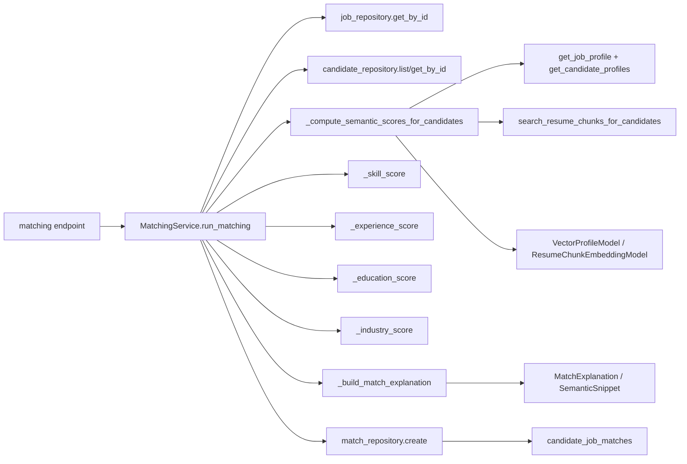

# Matching 链路梳理（仅分析匹配评分与落库）

本文件只覆盖“matching”这条主链：从匹配入口 API 到 `MatchingService.run_matching` 的五维评分拆解、语义(semantic)的 RAG/向量检索增强、`MatchExplanation` 生成，以及最终写入 `candidate_job_matches`。

---

## 1) matching 的入口 API 和 Service

### 1.1 API 入口
- `POST /api/v1/matching/run`
  - 路径：`app/api/v1/endpoints/matching.py:run_matching`
  - 传入：`job_id`、可选 `candidate_ids`
  - 调用：`matching_service.run_matching(job_id, candidate_ids, delete_old=True)`
- `POST /api/v1/matching/retry-for-candidate`
  - 路径：`app/api/v1/endpoints/matching.py:retry_for_candidate`
  - 做法：先删掉该 `(job, candidate)` 的旧 match，再调用 `matching_service.run_matching(..., delete_old=False, candidate_ids=[...])`

### 1.2 Service
- `MatchingService`（`app/services/matching_service.py`）
  - 单例：`matching_service = MatchingService()`
  - 核心方法：`run_matching(job_id, candidate_ids=None, delete_old=True)`
  - 解释结果用于 `MatchExplanation`，并落库到 `candidate_job_matches.explanation`

---

## 2) score 如何拆成 skill / experience / education / industry / semantic

`MatchingService.run_matching` 对每个候选人计算 5 个子分，然后用权重求加权总分：

- 技能分：`skill_s`
  - 函数：`_skill_score(job_struct, profile)`
  - 来自：`job.structured.required_skills / preferred_skills` + `candidate.skills`
- 经验分：`exp_s`
  - 函数：`_experience_score(job, job_struct, profile)`
  - 来自：`job.min_years` 或 `job_structured.min_years` + `candidate.years_of_experience`
- 学历分：`edu_s`
  - 函数：`_education_score(job, job_struct, profile)`
  - 来自：`job.education_requirement` 或 `job_structured.education_requirement` + `candidate.education/highest_education`
- 行业分：`ind_s`
  - 函数：`_industry_score(job_struct, profile)`
  - 来自：`job_structured.industry_preference` + `candidate.summary/work_experience[].industry`
- 语义分：`sem_s`
  - 函数：`_compute_semantic_scores_for_candidates(job, job_struct, candidates)`
  - 来自：`vector_store` 对 job/candidate vector 的相似度 + 候选证据 chunks 的增强

五维权重（来自代码常量）：
- `WEIGHT_SKILL = 0.40`
- `WEIGHT_EXPERIENCE = 0.25`
- `WEIGHT_SEMANTIC = 0.20`
- `WEIGHT_EDUCATION = 0.10`
- `WEIGHT_INDUSTRY = 0.05`

总分计算函数：
- `app/services/matching_service.py:_overall_score(skill, experience, education, semantic, industry)`

---

## 3) 每个子分的计算函数在哪里

所有子分计算函数都在同一个文件：`app/services/matching_service.py`

关键函数清单：
- `_build_candidate_profile(candidate: CandidateModel) -> Dict[str, Any]`
  - 作用：把 `CandidateModel` 映射成规则计算所需的统一 profile 字段
- `_skill_score(job_structured, profile) -> (score, details)`
- `_experience_score(job, job_structured, profile) -> (score, details)`
- `_education_score(job, job_structured, profile) -> (score, details)`
- `_industry_score(job_structured, profile) -> (score, details)`
- `_compute_semantic_scores_for_candidates(job, job_structured, candidates) -> Dict[candidate_id, (semantic_score, details)]`
  - async：负责读取向量/检索证据/计算语义分
- `_overall_score(skill, experience, education, semantic, industry) -> float`
- `_pros_cons_recommendation(skill_score, experience_score, education_score, industry_score, overall_score) -> (pros, cons, recommendation)`
- `_build_match_explanation(...) -> MatchExplanation`
  - 把各维 details 映射成 HR 可读的结构化解释

另：semantic 计算过程中使用向量相似度：
- `app/rag/vector_store.py:_cosine`（matching_service 里以 `from app.rag.vector_store import vector_store, _cosine` 方式使用）

---

## 4) MatchExplanation 是在哪里生成的

生成位置在：
- `app/services/matching_service.py:_build_match_explanation(...)`

生成步骤（在 `run_matching` 内）：
1. 先调用 `_build_match_explanation(...)` 生成基础解释对象 `explanation`
   - 主要包含：`hard_requirements_met`、`missing_requirements`、`strong_signals`、`risk_signals`、`summary_for_hr`、`interview_focus_points`、`suggested_action`
2. 再把 semantic 相关信息补进去：
   - `explanation.semantic_status = sem_details.get("semantic_status")`
   - 若存在 `evidence_snippets`：把每条证据映射为 `SemanticSnippet(source_type, text, score)`，写入 `explanation.semantic_evidence`

解释的 schema 定义在：
- `app/schemas/match.py:MatchExplanation` 与 `SemanticSnippet`

---

## 5) candidate_job_matches 是在哪里写入的

写入位置在：
- `app/services/matching_service.py:MatchingService.run_matching`

具体落库调用：
- `await match_repository.create(...)`

落库字段来源（`match_repository.create` 参数）：
- `overall_score`
- `skill_score`
- `experience_score`
- `education_score`
- `semantic_score`
- `industry_score`
- `pros/cons/recommendation`
- `explanation=explanation.model_dump()`
- `status=statuses.MATCH_STATUS_COMPLETED`

最终写入表：
- `app/database/models.py:CandidateJobMatchModel`，表名 `candidate_job_matches`

可用的 explanation JSON 结构来自 `app/schemas/match.py`（`MatchExplanation.model_dump()`）

---

## 6) RAG 在 matching 中是增强排序/增强解释/还是核心评分来源

结论：RAG 是**核心评分来源的一部分（semantic 维度）**，同时对解释也有增强作用；它不是唯一评分来源。

解释如下：
1. overall score 的五维加权里，semantic 占 `0.20`
2. semantic_score 本身由 `_compute_semantic_scores_for_candidates` 计算：
   - 先用 `vector_store.get_job_profile` + `vector_store.get_candidate_profiles` 得到 job/candidate 向量
   - 对候选人做 cosine 相似度，得到 `base_sim`
   - base_sim 通过 `_semantic_band_score` 变为 `base_score`
3. 若候选人的 resume chunks 已建立索引，并且语义 chunk 检索成功：
   - `_compute_semantic_scores_for_candidates` 会用 `vector_store.search_resume_chunks_for_candidates(...)` 取证据 snippets
   - 然后基于证据的 `top3_avg`、`coverage_score`、`importance_weight` 计算最终 `semantic_score`
4. semantic 的证据还会被嵌入解释：
   - `explanation.semantic_evidence = [SemanticSnippet(...)]`

因此：
- 排序（最终 overall）上：semantic 维度直接影响最终排序，是排序机制的组成部分
- 解释上：semantic evidence/snippets 提供“可追溯”的解释增强
- 核心评分来源上：其它四维（skill/experience/education/industry）完全是规则/字段驱动，不依赖 RAG

---

## 7) matching 对 job / candidate / vector profile 的依赖

### 7.1 对 job / candidate 的依赖
- `job_repository.get_by_id(job_id)` 提供：
  - `job.structured`（参与 skill/education/industry 等维度）
  - `job.min_years`（经验维度兜底）
  - `job.education_requirement`（学历维度兜底）
  - `job.raw_jd_text`（用于某些语义文本构建，但 matching 的显式语义文本生成并不依赖它）
- `candidate_repository.list/get_by_id` 提供：
  - `candidate.skills`
  - `candidate.years_of_experience`
  - `candidate.education`
  - `candidate.highest_education`
  - `candidate.work_experience`
  - `candidate.summary`
  - `candidate.projects`
  - 以上用于 rule-based 四维评分；semantic 维度主要来自 vector_profiles/resume_chunk_embeddings

### 7.2 对 vector profile / chunks 的依赖（RAG 部分）
semantic 计算需要以下向量/证据落库存在：
- `vector_profiles` 中：
  - job：`entity_type="job" AND profile_type="general"`（通过 `vector_store.get_job_profile(job.id)` 读取）
  - candidate：`entity_type="candidate" AND profile_type="general"`（通过 `vector_store.get_candidate_profiles(candidate_ids)` 读取）
- `resume_chunk_embeddings` 中：
  - 证据 chunks：`status="available"` 的 chunk 用于 `vector_store.search_resume_chunks_for_candidates(...)`

若向量缺失：
- job 向量缺失：semantic_score 直接为 `0.0`，semantic_status 标记为 `not_indexed`（或从 VectorProfileModel.status 读取）
- candidate chunks 缺失：semantic_score 退化为 base_score（并设置语义状态为 `evidence_not_indexed/search_failed`）

---

## 调用链（调用栈视图）

```text
Client
  -> app/api/v1/endpoints/matching.py:run_matching
      -> app/services/matching_service.py:matching_service.run_matching
          -> app/database/repository/job_repository.py:job_repository.get_by_id
          -> app/database/repository/candidate_repository.py:candidate_repository.list/get_by_id
          -> app/database/repository/match_repository.py:match_repository.delete_by_job (delete_old=True)
          -> app/services/matching_service.py:_compute_semantic_scores_for_candidates
              -> app/rag/vector_store.py:vector_store.get_job_profile
              -> app/rag/vector_store.py:vector_store.get_candidate_profiles
              -> app/rag/vector_store.py:vector_store.search_resume_chunks_for_candidates
              -> app/database/models.py:VectorProfileModel / ResumeChunkEmbeddingModel (用于 status 与 has_chunks 判断)
          -> _skill_score / _experience_score / _education_score / _industry_score
          -> _overall_score
          -> _pros_cons_recommendation
          -> _build_match_explanation
          -> 写入 app/database/repository/match_repository.py:match_repository.create
              -> 表 app/database/models.py:CandidateJobMatchModel -> candidate_job_matches
```

---

## 核心评分流程（文字版）

对每个候选人（candidate）执行：
1. 规则构造 profile：`_build_candidate_profile(candidate)`
2. 计算子分：
   - `skill_s, skill_details = _skill_score(job_struct, profile)`
   - `exp_s, exp_details = _experience_score(job, job_struct, profile)`
   - `edu_s, edu_details = _education_score(job, job_struct, profile)`
   - `ind_s, industry_details = _industry_score(job_struct, profile)`
   - `sem_s, sem_details = semantic_map[candidate.id]`（由 `_compute_semantic_scores_for_candidates` 预先算好）
3. 计算总分：`overall = _overall_score(skill_s, exp_s, edu_s, sem_s, ind_s)`
4. 生成 pros/cons/recommendation：`_pros_cons_recommendation(...)`
5. 生成 explanation：
   - `explanation = _build_match_explanation(job, job_struct, profile, ...details..., overall)`
   - 把 semantic 的 status/evidence 填入 `explanation`
6. 落库写入 `candidate_job_matches`：
   - `match_repository.create(..., explanation=explanation.model_dump(), status=COMPLETED)`
7. 最后对所有 match 按 `overall_score` 降序排序返回。

---

## 关键函数清单（按用途）

### 入口与主流程
- `app/api/v1/endpoints/matching.py:run_matching`
- `app/services/matching_service.py:MatchingService.run_matching`

### 子分计算
- `app/services/matching_service.py:_skill_score`
- `app/services/matching_service.py:_experience_score`
- `app/services/matching_service.py:_education_score`
- `app/services/matching_service.py:_industry_score`
- `app/services/matching_service.py:_compute_semantic_scores_for_candidates`（async）

### 汇总与解释
- `app/services/matching_service.py:_overall_score`
- `app/services/matching_service.py:_pros_cons_recommendation`
- `app/services/matching_service.py:_build_match_explanation`
- `app/rag/vector_store.py:_cosine`（semantic base_sim）

### 落库
- `app/services/matching_service.py:match_repository.create`
- `app/database/repository/match_repository.py:MatchRepository.create`

---

## 依赖关系图（依赖对象 -> 计算模块）



